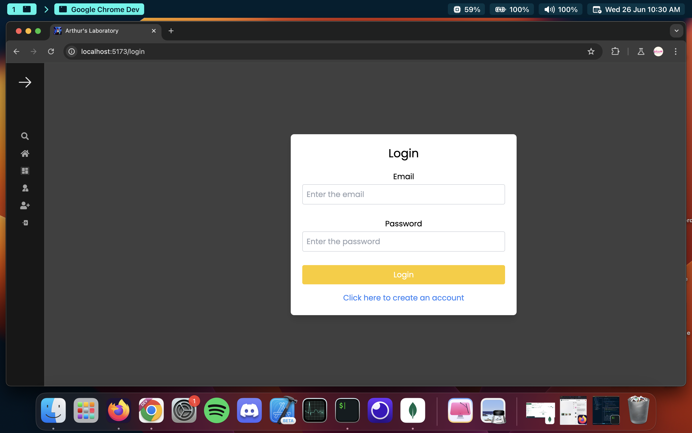

# Arthur-s-Laboratory

## Overview

This is a full-stack blog application built with React for the frontend and Node.js/Express for the backend. The application allows users to register, log in, create posts, and interact with other users. The frontend is deployed on Vercel, and the backend is deployed on Heroku.

## Features

- User authentication (registration, login, and logout)
- Create, read, update, and delete posts
- Comment on posts
- Responsive design
- Navigation bar with user-specific options
- Background video on the home page

## Screenshots



## Demo Video

[]

## Technologies Used

### Frontend

- React
- React Router
- Tailwind CSS
- Framer Motion
- Vite
- Vercel (deployment)

### Backend

- Node.js
- Express
- MongoDB
- Mongoose
- JWT for authentication
- Bcrypt for password hashing
- Heroku (deployment)

## Getting Started

### Prerequisites

Make sure you have the following installed on your machine:

- Node.js
- npm
- MongoDB

### Installation

1. **Clone the repository:**

   ````sh
    git clone https://github.com/CodePro-ABridges/Arthur-s-Laboratory
    cd your-repo
    cd frontend
    npm install
    cd ../backend
    npm install
    create you .env file(given the .env.EXAMPLE)
    ideas and comment on existing posts.```
   ````
